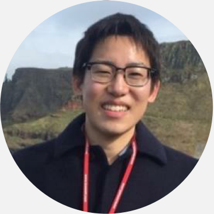
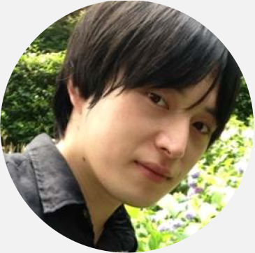
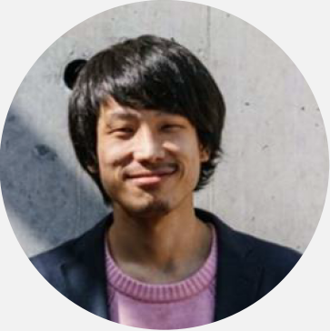
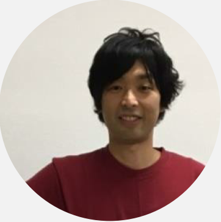
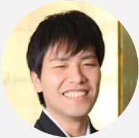
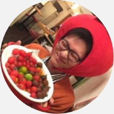

# The Decobocollabo Teams

2021年07月09日現在  
※あいうえお順

| 氏名 | ①所属　②学位・資格　③チーム内での担当　④ひとこと　⑤SNSなど |
| :----: | :---- | 
| **家永 直人**   Naoto Ienaga  | ①慶應義塾大学理工学部情報工学科助教 ② ③ ④ ⑤[Researchmap](https://researchmap.jp/naotoienaga)  |
| **石原 裕之**   Hiroyuki Ishihara  | ①NTT ② ③ ④ ⑤  |
| **榎本 大貴**   Daiki Enomoto   | ①株式会社LITALICO LITALICO研究所マネジャー／チーフリサーチャー ② ③ ④ ⑤ |
| **高畑 脩平**  Shuhei Takahata    | ①藍野大学医療保健学部作業療法学科助教など ② ③ ④ ⑤ |
| **寺山 慧**  Kei Terayama    | ①横浜市立大学理学部理学科生命医科学研究科生命医科学専攻准教授 ② ③ ④ ⑤ |
| **野田 遥**   Haruka Noda   | ①長崎大学大学院医歯薬学総合研究科医療科学専攻、国立障害者リハビリテーションセンター 研究所研究生、独立行政法人日本学術振興会特別研究員(DC2) ② ③ ④ ⑤  |
| **萩原 広道**  Hiromichi Hagihara  | ①東京大学国際高等研究所ニューロインテリジェンス国際研究機構(IRCN)特別研究員、独立行政法人日本学術振興会特別研究員(PD)、京都市指定児童発達支援事業所こどもの杜広場のびのび顧問作業療法士ほか ②博士(人間・環境学)、作業療法士、公認心理師 ③研究計画立案、データ収集、解析、論文執筆、アウトリーチ ④このチームでの活動はいつもとっても楽しいです。異分野・異職種のみなさんにいつも刺激を受けています。 ⑤[Website](https://hagi-hara.jimdofree.com)、[Researchmap](https://researchmap.jp/hagiii)、[Twitter](https://twitter.com/hagiharahiro) |

<!--
| 氏名 | 所属 | 学位・資格 | チーム内での担当 | ひとこと | SNSなどのリンク |
| :----: | :---- | :---- | ---- | ---- | ---- |
| 萩原 広道 / Hagihara, Hiromichi  | ・東京大学国際高等研究所 ニューロインテリジェンス国際研究機構 (IRCN) 特別研究員 ・独立行政法人日本学術振興会 特別研究員 (PD) ・特定国立研究開発法人理化学研究所 言語発達研究チーム 客員研究員 ・京都市指定 児童発達支援事業所 こどもの杜広場 のびのび 顧問作業療法士 | ・博士 (人間・環境学) ・作業療法士 ・公認心理師 | ・研究計画立案 ・データ収集 ・解析 ・論文執筆 ・アウトリーチ | このチームでの活動はいつもとっても楽しいです。異分野・異職種のみなさんにいつも刺激を受けています。 | ・[個人web](https://hagi-hara.jimdofree.com) ・[Researchmap](https://researchmap.jp/hagiii) ・[Twitter](https://twitter.com/hagiharahiro) |
| 高畑 脩平  | 藍野大学 医療保健学部 作業療法学科 助教 |  |  |  |  |
| 寺山 慧  | 横浜市立大学 理学部 理学科 生命医科学研究科 生命医科学専攻 准教授 |  |  |  |  |
| 榎本 大貴  | 株式会社LITALICO LITALICO研究所 マネジャー／チーフリサーチャー |  |  |  |  |
| 石原 裕之  | NTT |  |  |  |  |
| 野田 遥  | 長崎大学 大学院 医歯薬学総合研究科 医療科学専攻 国立障害者リハビリテーションセンター 研究所 研究生 独立行政法人 日本学術振興会 特別研究員（DC2） |  |  |  |  |
| 家永 直人 / Ienaga, Naoto  | 慶應義塾大学 理工学部 情報工学科 助教 |  |  |  |  |
-->
