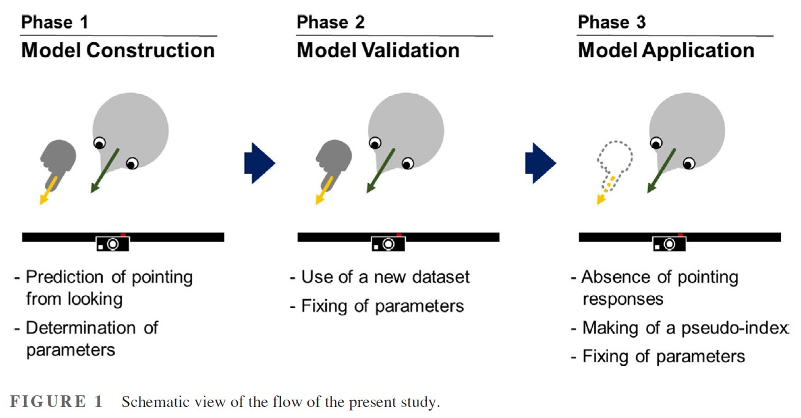
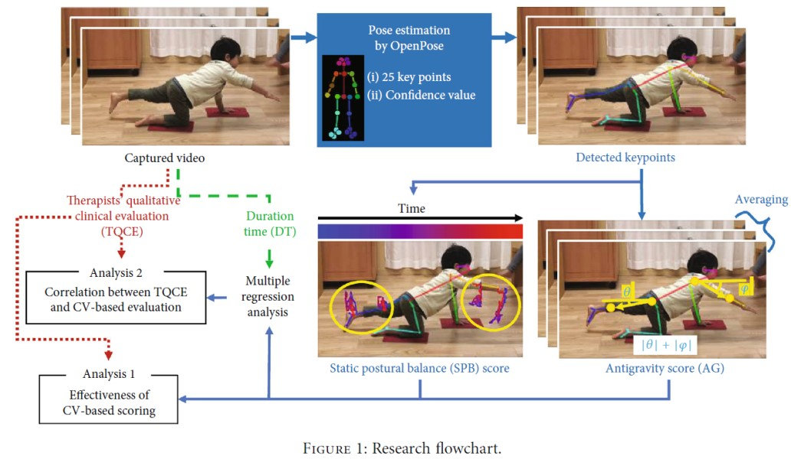

## 二肢強制選択法における指差しと視線の関係  
* 視線でどれほど正確に指差しによる選択を推定できるのかを調査
* 多数決に基づく手法と機械学習の手法の両方において、実用的な精度（>0.85）で指差しによる選択を推定可能であった
* 視線が指差しの合理的な代替手段になり得ることを示した
* この結果は異なるモダリティの結果を包括的に解釈するのに役立つ

<!--  -->

 

## 姿勢の安定性の定量評価  
* 姿勢の安定性をコンピュータビジョンの技術で定量的に測定する  
* 身体のいくつかの関節の遷移の可視化や、それを基に安定度を算出
* 作業療法士の臨床における評価とも高い相関
* 1つの課題から複数の身体機能の評価が可能となったり、課題時間の短縮が可能となったりする可能性を示した

<!--  -->

## 表情
